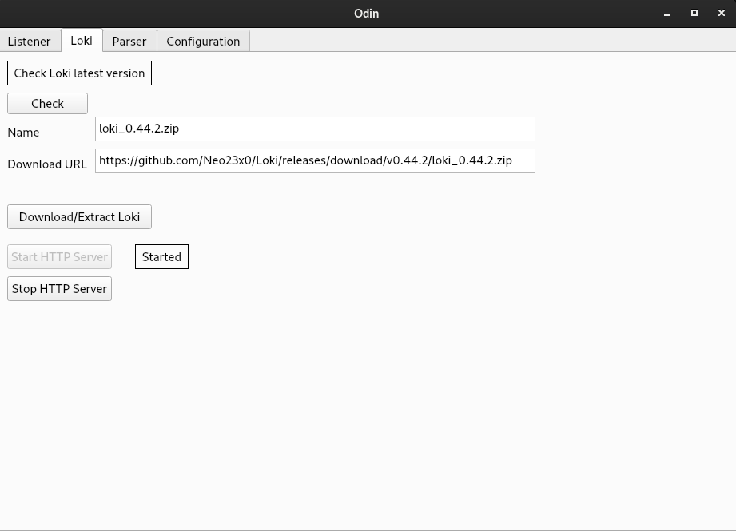
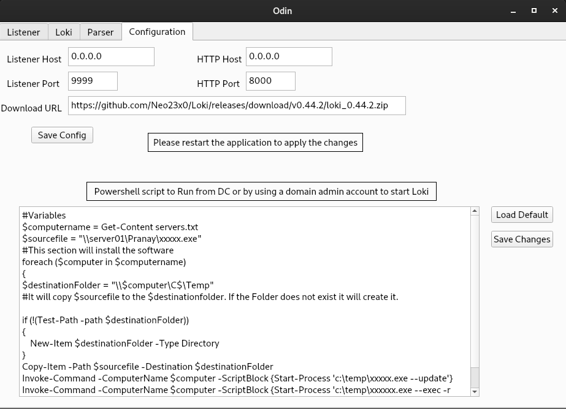
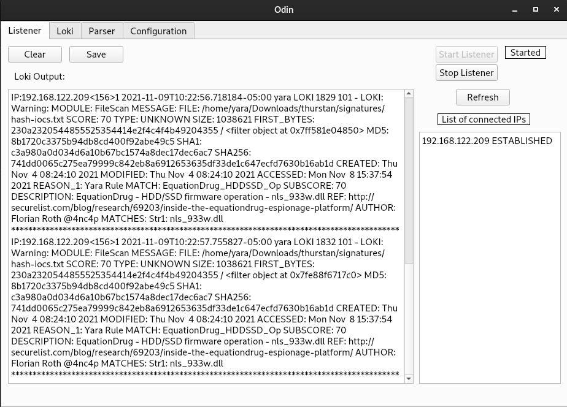
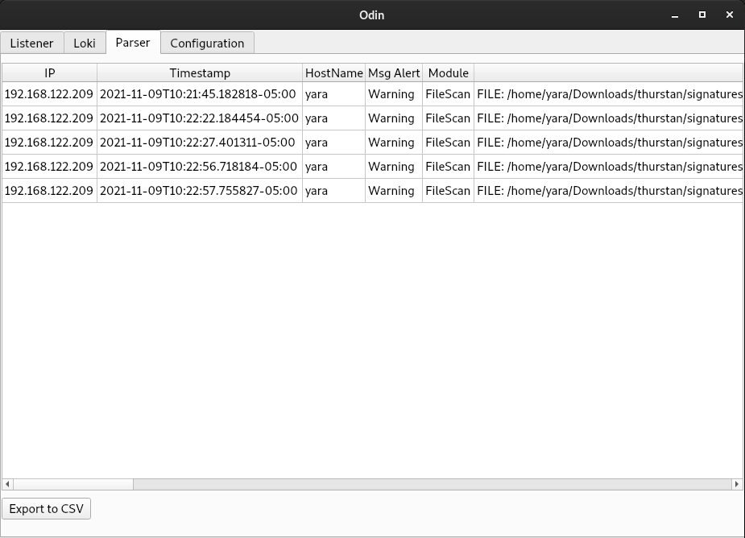

# LOki Scanner
 is a central IoC scanner based on [Loki](https://github.com/Neo23x0/Loki)

##  Table of Contents
- [General Info](#General_Info)
- [Requirements](#Requirements)
- [Fetching](#Fetch)
- [Deploying Loki](#Deploy_Loki)
- [Collecting](#Collecting)
- [Parsing](#Parsing)

## General Info 
This application  Loki latest version and download it on all machines using a powershell script and run it then this app receives the respose from all machines and parse the feed in CSV form.

## Requirements 
1. Python +3.5
2. PyQT5
3. psutil
4. pyparsing
5. zipfile

## Fetch 
Odin download and extract the latest version on Loki and start HTTP server to deliver the executable (Loki) to all machines.

<kbd></kbd>

## Deploy Loki 
This step has ti be done manually using powershell script on a DC machine or suing domain admin account which the script deliver loki to all machines and start updating.
The script is in Configurations tab and you can modiy the scipt as needed.

<kbd></kbd>

## Collecting 
Start the listener then from the powershell script start Loki to search for IoCs and results will be sent from Loki to Odin

<kbd></kbd>

## Parsing 
Collected logs will be parsed and can be exported as CSV file to be handled with something else like ELK.

<kbd></kbd>
